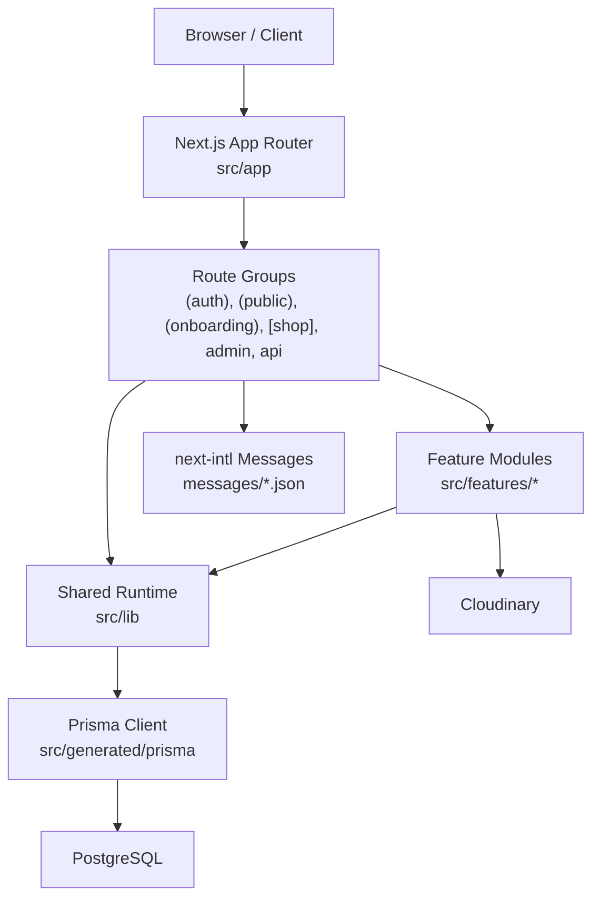
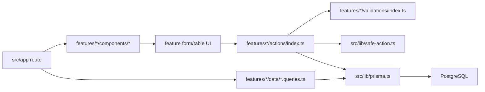

# Project Folder Structure Flow - Mini Market Myanmar

_Generated: 2026-08-13_

## Purpose

This document maps the current repository structure and explains how requests flow through the application. It is meant as a quick orientation file for future development, reviews, and onboarding.

## High-Level Application Flow



## Root Structure

```text
D:/solo/test/
  .agents/                  Local agent/skill workspace files
  .husky/                   Git hooks
  .next/                    Next.js build output, generated locally
  docs/                     Project context and architecture documentation
  messages/                 English and Myanmar translation files
  node_modules/             Installed dependencies
  prisma/                   Prisma schema, migrations, and seed script
  public/                   Static images and public assets
  scripts/                  Project scripts
  specs/                    Spec-driven development records
  src/                      Application source
  AGENTS.md                 Agent/project instructions
  CLAUDE.md                 Legacy/alternate assistant instructions
  PRODUCT_CREATION_FLOW.md  Product creation flow notes
  README.md                 Project readme
  saas_audit_report.md      SaaS audit notes
  package.json              Scripts and dependencies
  next.config.ts            Next.js config
  prisma.config.ts          Prisma config
  tsconfig.json             TypeScript config
  vitest.config.mts         Vitest config
```

## Source Structure

```text
src/
  app/          Next.js App Router pages, layouts, route handlers, and loading/error UI
  components/   Shared UI, layout, common, and editor components
  constants/    Static application data such as Myanmar region/division/township data
  context/      React context providers
  features/     Feature modules with actions, components, data, hooks, validations, and types
  generated/    Generated Prisma client output
  hooks/        Shared React hooks
  i18n/         next-intl request configuration
  lib/          Shared server/client utilities and integrations
  store/        Zustand stores
  styles/       Global CSS and style support files
  tests/        Vitest tests and action test setup
```

## Route Structure

```text
src/app/
  (auth)/
    sign-in/              Public sign-in page
    sign-up/              Public sign-up page
    social-check-auth/    OAuth/session check page
  (onboarding)/
    create-shop/          First-shop creation flow
    dashboard-redirect/   Redirect route after onboarding/auth
  (public)/
    page.tsx              Public landing page
    shops/                Shops directory route
  admin/
    layout.tsx            Admin layout
    audit-log/            Admin audit log page
  api/
    auth/[...all]/        Better Auth route handler
    exports/order/        Order export endpoint
    exports/product/      Product export endpoint
    sign-cloudinary-params/ Signed Cloudinary upload endpoint
  [shop]/
    page.tsx              Public shop home
    layout.tsx            Per-shop layout
    cart/                 Public cart and create-order route
    products/             Public product list and product detail
    dashboard/            Shop-owner dashboard
```

## Dashboard Route Flow

```text
/{shop}/dashboard/
  page.tsx
  attributes/
    create/
    [attributeId]/
    [attributeId]/edit/
  brands/
    create/
    [brandId]/
    [brandId]/edit/
  categories/
    create/
    [categoryId]/
    [categoryId]/edit/
  orders/
    [orderId]/
  products/
    create/
    [productId]/
    [productId]/edit/
  promotions/
    create/
    [id]/edit/
  calculator/
  invoices/
  sales/
  settings/
  theme/
    invoice/
```

## Feature Module Map

```text
src/features/
  audit-log/                  Admin audit log data access
  auth/                       Auth actions, UI helpers, hooks, validation
  cart/                       Public cart UI, hooks, and cart types
  cloudinary/                 Signed-upload helpers and image upload field
  dashboard-attributes/       Attribute dashboard CRUD
  dashboard-brands/           Brand dashboard CRUD
  dashboard-categories/       Category dashboard CRUD
  dashboard-orders/           Order dashboard data, actions, and table/detail UI
  dashboard-products/         Product dashboard CRUD, wizard, variants, export support
  dashboard-promotions/       Promotion dashboard CRUD and targeting
  public-design/              Public landing/home presentation components
  settings/                   Shop settings tabs and form UI
  shop/                       Shop actions, data access, storefront header/grid/hero components
  storefront-brands/          Public brand data and list UI
  storefront-categories/      Public category data and list UI
  storefront-products/        Public product listing/detail, purchase panel, variants, specs, addons
```

## Standard Feature Flow

Most dashboard features follow this pattern:



## Request Flows

### Authentication

```text
User -> /sign-in or /sign-up
  -> src/features/auth/actions
  -> src/lib/auth.ts
  -> Better Auth route at /api/auth/[...all]
  -> Prisma auth tables
  -> onboarding/dashboard redirect
```

### Shop Onboarding

```text
Authenticated user -> /onboarding/create-shop
  -> src/features/shop/actions/shop.ts
  -> shop validation
  -> Prisma Shop create
  -> /{shop}/dashboard
```

### Public Storefront

```text
Customer -> /{shop}
  -> shop/storefront data queries
  -> product, category, brand lists
  -> /{shop}/products or /{shop}/products/{productId}
  -> cart store/hooks
  -> /{shop}/cart and /{shop}/cart/create-order
```

### Dashboard Mutations

```text
Shop owner -> /{shop}/dashboard/<resource>
  -> route server component loads shop-scoped data
  -> feature table/form component renders
  -> next-safe-action mutation
  -> shopOwnerActionClient verifies ownership
  -> Prisma write scoped by shopId
  -> revalidatePath for affected dashboard/storefront routes
```

### Image Upload

```text
Dashboard form -> ImageUploadField/useCloudinary
  -> /api/sign-cloudinary-params
  -> Cloudinary signed upload
  -> Cloudinary URL stored in PostgreSQL
  -> rendered through Cloudinary/Next image components
```

### Export Flow

```text
Dashboard export button
  -> /api/exports/product or /api/exports/order
  -> feature data/export helper
  -> Excel workbook stream
  -> downloaded file
```

## Shared Runtime Files

```text
src/lib/
  auth.ts             Better Auth server configuration
  auth-client.ts      Better Auth browser client
  prisma.ts           Prisma singleton with pg adapter
  safe-action.ts      next-safe-action client hierarchy
  query.tsx           TanStack Query provider
  get-session.ts      Server session helper
  language.ts         Locale helpers
  parse-pagination.ts Pagination parser
  format.ts           Formatting helpers
  audit.ts            Audit helper
  utils.ts            cn() and shared utilities
```

## Data And Storage Boundaries

- `prisma/schema.prisma` is the database source of truth.
- `prisma/migrations/` contains migration history and should be committed.
- `src/generated/prisma/` is generated output and should not be edited manually.
- Database access should go through `src/lib/prisma.ts`.
- Dashboard reads should be shop-scoped through feature `data/` helpers.
- Mutations should use `next-safe-action`, Zod validation, and the correct safe-action client.
- Images are not stored locally; only Cloudinary URLs are persisted.
- User-facing text should be backed by `messages/en.json` and `messages/mm.json`.

## Testing Structure

```text
src/tests/
  actions/       Server action tests and shared test setup
  *.test.ts      Shared utility and storefront logic tests

src/features/*/test/
  Feature-local tests where present
```

Run checks with:

```bash
pnpm test
pnpm lint
pnpm build
```

## Structure Observations

- The app is organized around App Router routes plus feature modules, which is a good fit for a multi-tenant dashboard/storefront monolith.
- Dashboard feature modules are consistently named with the `dashboard-*` prefix, while public modules use `storefront-*`.
- Some implemented routes have moved beyond the older architecture notes: `admin/`, `api/exports/*`, `dashboard-orders`, cart order creation, and theme invoice routes now exist.
- `src/components/editor/` exists in the folder tree but has no tracked files in the current file listing.
- `src/app/api/exports/order/` exists as a directory, but no tracked route file appeared in the current `rg --files` output.
- `docs/progress-tracker.md` says several dashboard sections are route stubs, but `dashboard-orders` now has data, actions, and components. The tracker may need a separate functional status review.
